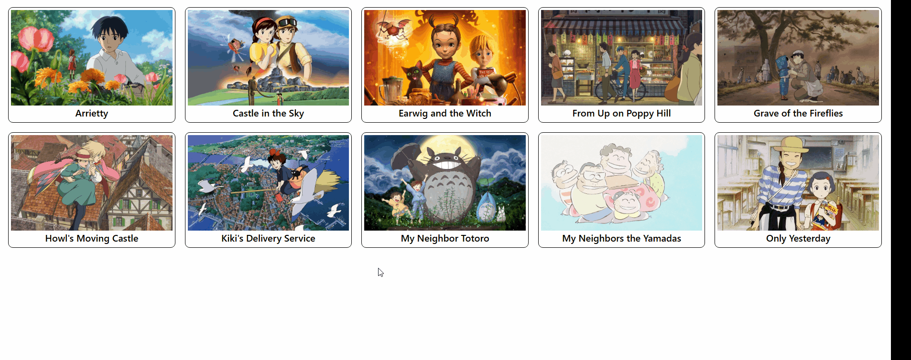

# Ghibli Studios Film Explorer

Aplicação em React para consultar e visualizar filmes da Ghibli Studios através da API pública do Ghibli API.



## Funcionalidades

- Listagem dos filmes em ordem alfabética, com paginação incremental ("carregar mais")
- Navegação para os detalhes de cada filme, com fundo ilustrado pelo banner do filme
- Exibição de diretor, produtor, data de lançamento, duração e nota Rotten Tomatoes
- Tema claro/escuro com alternância animada e preferência salva entre visitas
- Header fixo com navegação sempre acessível
- Interface responsiva, do celular ao desktop

## Stack

- React 19
- TypeScript
- Vite
- React Router DOM (HashRouter)
- Tailwind CSS v4
- Google Fonts (Baloo 2 + Nunito)
- oxlint

## Pré-requisitos

- Node.js 18+
- npm

## Instalação

```bash
npm install
```

## Execução

```bash
npm run dev
```

A aplicação será iniciada em modo de desenvolvimento no navegador.

## Build

```bash
npm run build
```

## Lint

```bash
npm run lint
```

## Deploy

O projeto é publicado no GitHub Pages via `gh-pages`:

```bash
npm run deploy
```

Usa `HashRouter` em vez de `BrowserRouter` para que a navegação entre páginas funcione corretamente num servidor de arquivos estático, sem configuração adicional de rotas do lado do servidor.

## Estrutura do projeto

```bash
src/
  components/
  hooks/
  pages/
  services/
  types/
```

Componentes e páginas ficam em arquivos únicos (ex: `FilmCard.tsx`), sem subpastas com `index.tsx` — evita ambiguidade ao abrir várias abas com o mesmo nome de arquivo no editor.

## API utilizada

A aplicação consome a API pública:

```bash
https://ghibliapi.vercel.app/films
```

## Decisões técnicas

- O serviço de API (`services/ghibliApi.ts`) lança erros em vez de tratá-los internamente — cada componente decide como reagir (mensagem de erro, estado de loading), mantendo a lógica de requisição desacoplada da apresentação.
- As cores do tema são definidas como variáveis CSS (`@theme` do Tailwind v4), sobrescritas por um atributo `data-theme` no `<html>` — permite trocar o tema inteiro sem alterar nenhuma classe nos componentes.
- A paginação da lista de filmes é feita inteiramente no cliente: a API devolve todos os filmes numa única chamada, e um estado local controla quantos são exibidos por vez.
- A tipografia separa uma fonte de destaque (Baloo 2) para títulos de uma fonte de leitura (Nunito) para o corpo do texto.

## Observação

Este projeto foi desenvolvido como desafio de front-end para consumir dados externos e praticar rotas, renderização, integração com APIs, gerenciamento de tema e paginação client-side.

## Autor

Vitor da Rosa

- Links:
  [GitHub](https://github.com/vturose)